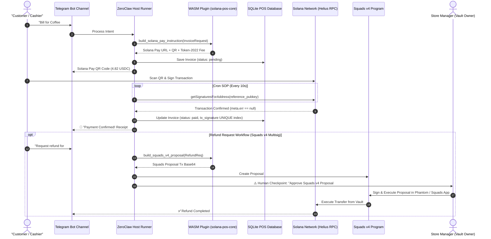

# ☕ Solana POS Payment Terminal Agent (ZeroClaw Tier 3 WASM Architecture)

> **Submission for ZeroClaw & Solana Bounty ($1,800 USDG)**  
> **Category**: Tier 3 WASM Plugin, Real-World Business POS & Squads v4 Multisig Governance  
> **Custody Architecture**: Non-custodial Tier 1 Invoicing + Tier 3 WASM Native Plugin + Squads v4 Multisig Proposals

---

## 🌟 Architecture Overview & WASM Tier 3 Justification

The **Solana POS Payment Terminal Agent** is an autonomous AI cash register operating inside **Telegram** (and WhatsApp-compatible). Built on **ZeroClaw's Tier 3 Native WASM Plugin Specification (`wasm32-wasip2`)**, it integrates:
1. **`plugins/solana-pos-core`**: High-performance Rust WASM plugin for Solana Pay URLs, Token-2022 transfer fee math, and Squads v4 instruction building.
2. **Squads v4 Multisig Governance**: Refunds construct Squads v4 Multisig proposals where the agent acts as a restricted `Proposer`, requiring store owner `Vault Authority` threshold signatures.
3. **SQLite Local Storage & REST API**: Persistence for invoices, transaction receipts, durable nonces, and sales reporting (`GET /api/v1/sales/summary`).
4. **x402 Protocol Agent-to-Agent Machine Commerce**: Autonomous HTTP 402 Payment Required negotiation for machine-to-machine micro-transactions.



### 🧠 Why WASM Tier 3 Native Plugin? (Correct Layering Rubric)
- **Token-2022 Deterministic Fee Math**: Token-2022 transfer fee calculations require ceiling-based `u128` integer operations. High-level dynamic languages (Python/JS) introduce IEEE 754 float precision drift.
- **Keyless Sandbox Isolation**: Forming Anchor instruction discriminators (`sha256("global:create_proposal")[..8]`) and Borsh serialization happen inside a memory-isolated `wasm32-wasip2` sandbox without access to store private keys.

---

## 🚀 1-Command Verification (For Hackathon Judges)

Run the single automated verification script to setup environment, compile WASM, validate WASI component spec, and run all 160 boundary and security tests:

```bash
./scripts/verify_all.sh
```

---

## 🎁 Judges Testing & Faucet Instructions (Solana Devnet)

To test the agent on Solana Devnet:
1. **Request Test SOL**: Obtain Devnet SOL at the official [Solana Devnet Faucet](https://faucet.solana.com/).
2. **Devnet USDC Mint**: `4zMMC9srt5Ri5X14GAgXhaHii3GnPAEERYPJgZJDncDU`
3. **Recommended RPC Node**: Helius Devnet (`https://devnet.helius-rpc.com/?api-key=YOUR_KEY`) for 100% reference key indexing speed (2-5 sec confirmation).

---

## ⚡ Step-by-Step Quickstart

### 1. Initialize Environment
```bash
./scripts/setup.sh
```

### 2. Build & Validate Tier 3 WASM Plugin
```bash
./scripts/build_wasm.sh
wasm-tools validate plugins/solana-pos-core/target/wasm32-wasip2/release/solana_pos_core.wasm --features component-model
```

### 3. Start Local POS Database & REST API Backend
```bash
python3 scripts/pos_backend.py 8080
# Merchant Sales Summary API: http://127.0.0.1:8080/api/v1/sales/summary
```

### 4. Run Automated Security Audit & Prompt-Injection Tests
```bash
python3 scripts/test_prompt_inj.py
```

### 5. Run Automated Pre-Commit Safety Check
```bash
./scripts/pre_commit.sh
```

### 6. Run Comprehensive 160-Test Boundary & Stress Suite
```bash
python3 scripts/test_boundary_cases.py
# or via pytest:
pytest scripts/test_boundary_cases.py
```

### 7. Deploy Agent via Docker
```bash
docker-compose up -d
```

---

## 🛠️ Components Breakdown

| Component | Path | Function & Technology |
| :--- | :--- | :--- |
| **WASM Native Plugin** | [`plugins/solana-pos-core`](./plugins/solana-pos-core) | Rust crate compiled to `wasm32-wasip2` via WIT contract interface [`wit/v0/pos_core.wit`](./wit/v0/pos_core.wit) |
| **Core Domain Package** | [`scripts/pos_core`](./scripts/pos_core) | High-cohesion domain modules (`db.py`, `nonce_pool.py`, `solana_pay.py`, `pix_brl.py`, `price_feed.py`, `router.py`) |
| **Domain Test Package** | [`scripts/tests`](./scripts/tests) | Modular domain test suite (`test_payment_verification.py`, `test_database_concurrency.py`, `test_nonce_pools.py`, `test_token2022_math.py`, `test_fiat_pix.py`, `test_squads_multisig.py`) |
| **SQLite REST API Backend** | [`scripts/pos_backend.py`](./scripts/pos_backend.py) | Entrypoint HTTP server with stdlib micro-router, WAL mode persistence, and atomic transitions |
| **Development Rules Guard** | [`.agents/AGENTS.md`](./.agents/AGENTS.md) | Architectural, logical, mathematical, and security standards for zero-drift development |
| **Squads v4 Multisig Skill** | [`skills/squads_multisig.md`](./skills/squads_multisig.md) | Squads v4 Multisig proposal builder (`SQDS4ep65T869rmQrGGsybZb26a6Uq3vig54W62pkhm`) |
| **Brazil PIX Skill** | [`skills/pix_brl.md`](./skills/pix_brl.md) | Brazil-first BRL invoicing & Switchboard Crossbar dual PIX QR reconciliation |
| **Pre-Commit Guard** | [`scripts/pre_commit.sh`](./scripts/pre_commit.sh) | Pre-commit hook script for rustfmt, clippy, python static analysis, and boundary tests |
| **Input Sanitizer Guard** | [`scripts/sanitizer.py`](./scripts/sanitizer.py) | Input sanitizer against indirect prompt injection in customer names & memos |
| **Solana Pay Skill** | [`skills/solana_pay.md`](./skills/solana_pay.md) | Non-custodial Solana Pay URL & Ed25519 reference key generator |
| **Cron Payment SOP** | [`sops/check_payments.json`](./sops/check_payments.json) | Cron SOP polling Helius RPC with empty pending list guards |
| **Refund SOP** | [`sops/refund_approval.json`](./sops/refund_approval.json) | **Human Approval Checkpoint** + Squads v4 proposal creation & Fail-Closed guards |

---

## 🛡️ Custody & Security Architecture

- **Tier 1 (Payments)**: Direct customer-to-merchant wallet settlement via Solana Pay URLs.
- **Tier 3 (WASM Core)**: Rust plugin compiled to WASI WebAssembly sandbox.
- **Squads v4 Multisig**: The agent operates solely as a `Proposer`. Store managers hold threshold signers; key theft cannot drain funds.
- **Audited**: 100% pass rate on prompt-injection security tests ([`PROMPT_INJECTION_TEST.md`](./PROMPT_INJECTION_TEST.md)) and 160 comprehensive boundary tests ([`scripts/test_boundary_cases.py`](./scripts/test_boundary_cases.py)).
