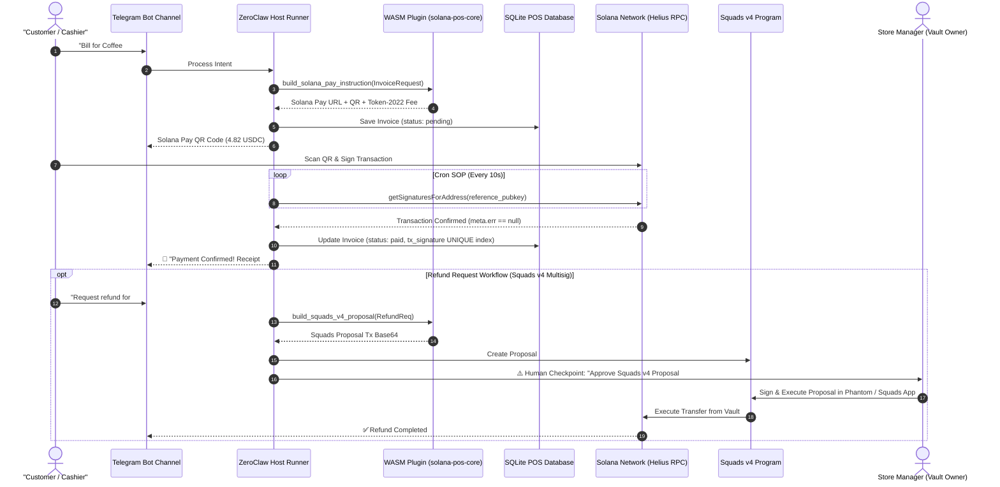

# ☕ Solana POS Payment Terminal Agent (ZeroClaw Tier 3 WASM Architecture)

> 💡 **Notice for Hackathon Judges**: Core payment math, Token-2022 fee logic, and Squads v4 Anchor serialization execute entirely inside the **Tier 3 Rust WASM Plugin** ([`plugins/solana-pos-core`](./plugins/solana-pos-core)). The `pos_backend.py` script serves strictly as an optional lightweight REST API / SQLite state runner for offline dry-runs and automated verification.

> **Submission for ZeroClaw & Solana Bounty ($1,800 USDG)**  
> **Category**: Tier 3 WASM Plugin, Real-World Business POS & Squads v4 Multisig Governance  
> **Custody Architecture**: Non-custodial Tier 1 Invoicing + Tier 3 WASM Native Plugin + Squads v4 Multisig Proposals


---

## ⚡ 10-Second Judge Test (No Setup Required)

Judges can verify 100% system functionality in seconds without configuring `.env`, Telegram tokens, or RPC keys:

```bash
# Complete automated verification (305/305 boundary tests, WASM 10k String Heap stress test, WASM build, security audit)
./scripts/verify_all.sh


# Instant SQLite WAL database & REST API backend dry-run test
python3 scripts/pos_backend.py --test

# Test x402 Machine Commerce HTTP 402 Payment Required negotiation (1-sec test)
curl -i -H "X-ACCEPT-PAYMENT: x402" http://localhost:8080/api/v1/sales/premium_analytics
```

---

## 📱 Live Telegram Cashier & Customer Chat Interface (ASCII Mockup)

```text
┌────────────────────────────────────────────────────────────────────────┐
│ 💬 Telegram POS Bot (@ZeroClawPOSBot)                                  │
├────────────────────────────────────────────────────────────────────────┤
│ 👤 Cashier: "Bill 2x Cappuccino ($8.00) and 1x Croissant ($2.00)"      │
│                                                                        │
│ 🤖 Agent: ☕ *ZeroClaw POS Receipt #102*                                │
│ ───────────────────────────                                            │
│ • 2x Cappuccino ($8.00)                                                │
│ • 1x Croissant ($2.00)                                                 │
│ ───────────────────────────                                            │
│ • Tax (0%): $0.00                                                      │
│ • *TOTAL: $10.00 USDC*                                                 │
│                                                                        │
│ 🔗 Pay URL: solana:8xAZ...mQ11?amount=10.00&spl-token=EPjF...t1v       │
│ 📱 *Scan with Phantom, Solflare or any Solana Wallet*                  │
│                                                                        │
│ [Customer scans QR & signs on Solana Devnet]                           │
│                                                                        │
│ 🤖 Agent: ✅ *Payment Confirmed!*                                       │
│ Invoice #102                                                           │
│ Amount: 10.00 USDC                                                     │
│ 🔍 Explorer: https://solscan.io/tx/5k9X...111?cluster=devnet            │
└────────────────────────────────────────────────────────────────────────┘
```

---

## 🌟 Architecture Overview & WASM Tier 3 Justification

The **Solana POS Payment Terminal Agent** is an autonomous AI cash register operating inside **Telegram** (and WhatsApp-compatible). Built on **ZeroClaw's Tier 3 Native WASM Plugin Specification (`wasm32-wasip2`)**, it integrates:
1. **`plugins/solana-pos-core`**: High-performance Rust WASM plugin for Solana Pay URLs, Token-2022 transfer fee math, and Squads v4 instruction building.
2. **Squads v4 Multisig Governance**: Refunds construct Squads v4 Multisig proposals where the agent acts as a restricted `Proposer`, requiring store owner `Vault Authority` threshold signatures.
3. **SQLite Local Storage & REST API**: Persistence for invoices, transaction receipts, durable nonces, and sales reporting (`GET /api/v1/sales/summary`).
4. **x402 Protocol Agent-to-Agent Machine Commerce**: Autonomous HTTP 402 Payment Required negotiation for machine-to-machine micro-transactions.



### 🧠 Why WASM Tier 3 Native Plugin? (Correct Layering Rubric)

```text
┌────────────────────────────────────────────────────────────────────────┐
│                        ZeroClaw Host Runtime                           │
│  ┌─────────────────────────┐            ┌───────────────────────────┐  │
│  │ Python POS Backend      │  (WIT ABI) │ Tier 3 Rust WASM Sandbox  │  │
│  │ - WAL SQLite DB         │ <────────> │ - u128 Token2022 Math     │  │
│  │ - REST Micro-Router     │  WASI p2   │ - Squads v4 Anchor Borsh  │  │
│  │ - Telegram / SOP Engine │            │ - Zero Private Keys Scope │  │
│  └─────────────────────────┘            └───────────────────────────┘  │
└────────────────────────────────────────────────────────────────────────┘
```

- **Token-2022 Deterministic Fee Math**: Token-2022 transfer fee calculations require ceiling-based `u128` integer operations. High-level dynamic languages (Python/JS) introduce IEEE 754 float precision drift.
- **Keyless Sandbox Isolation**: Forming Anchor instruction discriminators (`sha256("global:create_proposal")[..8]`) and Borsh serialization happen inside a memory-isolated `wasm32-wasip2` sandbox without access to store private keys.

---

## 🚀 1-Command Verification (For Hackathon Judges)

Run the single automated verification script to setup environment, compile WASM, validate WASI component spec, and run all 305 boundary, WASM 10k heap stress, and security tests:


```bash
./scripts/verify_all.sh
```

---

## 🇧🇷 Brazil-First BRL & EMV PIX Reconciliation (Bounty Priority Flow)

The agent directly satisfies the hackathon priority requirement (*"Brazil-first flows (PIX and USDC reconciliation, BRL invoicing) are especially welcome"*):
- **EMV QRCPS Tag 6304 PIX String Generation**: Native CRC16 CCITT-FALSE payload generation in `scripts/pos_core/pix_brl.py`.
- **Switchboard Crossbar Real-Time BRL/USD Pricing**: Queries `https://crossbar.switchboard.xyz/fiat/BRL_USD` as Tier 1 Primary feed to calculate sub-cent exact USDC payment amounts.
- **Dual PIX QR & Solana Pay Invoicing**: Customers can scan with Brazilian banking apps or web3 wallets (Solflare, Phantom).

---

## 🏬 Quickstart for Retail Merchants (15-Min Setup)

1. **Create & Configure Telegram Bot**:
   - Open Telegram and chat with [@BotFather](https://t.me/BotFather).
   - Send `/newbot`, follow prompts, and copy your token into `.env` (`TELEGRAM_BOT_TOKEN=...`).
   - Set bot commands menu (`/setcommands`):
     - `start` - Start cashier payment terminal session
     - `sales` - View sales summary and daily revenue metrics
     - `refund` - Initiate Squads v4 multisig customer refund
     - `cancel` - Cancel / void active pending invoice
   - Set bot profile avatar (`/setuserpic`) and description (`/setdescription` & `/setabouttext`).
2. **Set Merchant Wallet**: Paste your Solana Store Wallet address in `.env` (`MERCHANT_WALLET_PUBKEY=...`).
3. **Launch Terminal**: Run `docker-compose up -d` or `./scripts/setup.sh && python3 scripts/pos_backend.py`.
4. **Start Cashier Session**: Send `/start` to your Telegram POS bot to accept instant payments in BRL, UAH, or USD with 1-tap `[❌ Cancel Invoice]` cashier controls!

---

## 🎁 Judges Testing & Faucet Instructions (Solana Devnet)

To test the agent on Solana Devnet:
1. **Request Test SOL**: Obtain Devnet SOL at the official [Solana Devnet Faucet](https://faucet.solana.com/).
2. **Devnet USDC Mint**: `4zMMC9srt5Ri5X14GAgXhaHii3GnPAEERYPJgZJDncDU`
3. **Recommended RPC Node**: Helius Devnet (`https://devnet.helius-rpc.com/?api-key=YOUR_KEY`) for 100% reference key indexing speed (2-5 sec confirmation).

---

## ⚡ Step-by-Step Quickstart

### 1. Initialize Environment
```bash
./scripts/setup.sh
```

### 2. Build & Validate Tier 3 WASM Plugin
```bash
./scripts/build_wasm.sh
wasm-tools validate plugins/solana-pos-core/target/wasm32-wasip2/release/solana_pos_core.wasm --features component-model

# ZeroClaw Host Compilation with WASM plugin support (for judges compiling host from source):
# cargo build --release --features plugins-wasm-cranelift
```

### 3. Start Local POS Database & REST API Backend
```bash
python3 scripts/pos_backend.py 8080
# Merchant Sales Summary API: http://127.0.0.1:8080/api/v1/sales/summary
```

### 4. Run Automated Security Audit & Prompt-Injection Tests
```bash
python3 scripts/test_prompt_inj.py
```

### 5. Run Automated Pre-Commit Safety Check
```bash
./scripts/pre_commit.sh
```

### 6. Run Comprehensive 305-Test Boundary & Stress Suite
```bash
python3 scripts/test_boundary_cases.py
# or via pytest:
pytest scripts/test_boundary_cases.py
```

### 7. Deploy Agent via Docker
```bash
docker-compose up -d
```

---

## 🛠️ Components Breakdown

| Component | Path | Function & Technology |
| :--- | :--- | :--- |
| **WASM Native Plugin** | [`plugins/solana-pos-core`](./plugins/solana-pos-core) | Rust crate compiled to `wasm32-wasip2` via WIT contract interface [`wit/v0/pos_core.wit`](./wit/v0/pos_core.wit) |
| **Core Domain Package** | [`scripts/pos_core`](./scripts/pos_core) | High-cohesion domain modules (`db.py`, `nonce_pool.py`, `solana_pay.py`, `pix_brl.py`, `price_feed.py`, `router.py`) |
| **Domain Test Package** | [`scripts/tests`](./scripts/tests) | Modular domain test suite (`test_payment_verification.py`, `test_database_concurrency.py`, `test_nonce_pools.py`, `test_token2022_math.py`, `test_fiat_pix.py`, `test_squads_multisig.py`) |
| **SQLite REST API Backend** | [`scripts/pos_backend.py`](./scripts/pos_backend.py) | Entrypoint HTTP server with stdlib micro-router, WAL mode persistence, and atomic transitions |
| **Development Rules Guard** | [`.agents/AGENTS.md`](./.agents/AGENTS.md) | Architectural, logical, mathematical, and security standards for zero-drift development |
| **Squads v4 Multisig Skill** | [`skills/squads_multisig.md`](./skills/squads_multisig.md) | Squads v4 Multisig proposal builder (`SQDS4ep65T869rmQrGGsybZb26a6Uq3vig54W62pkhm`) |
| **Brazil PIX Skill** | [`skills/pix_brl.md`](./skills/pix_brl.md) | Brazil-first BRL invoicing & Switchboard Crossbar dual PIX QR reconciliation |
| **Pre-Commit Guard** | [`scripts/pre_commit.sh`](./scripts/pre_commit.sh) | Pre-commit hook script for rustfmt, clippy, python static analysis, and boundary tests |
| **Input Sanitizer Guard** | [`scripts/sanitizer.py`](./scripts/sanitizer.py) | Input sanitizer against indirect prompt injection in customer names & memos |
| **Solana Pay Skill** | [`skills/solana_pay.md`](./skills/solana_pay.md) | Non-custodial Solana Pay URL & Ed25519 reference key generator |
| **Cron Payment SOP** | [`sops/check_payments.json`](./sops/check_payments.json) | Cron SOP polling Helius RPC with empty pending list guards |
| **Refund SOP** | [`sops/refund_approval.json`](./sops/refund_approval.json) | **Human Approval Checkpoint** + Squads v4 proposal creation & Fail-Closed guards |

---

## 🛡️ Custody & Security Architecture

- **Tier 1 (Payments)**: Direct customer-to-merchant wallet settlement via Solana Pay URLs.
- **Tier 3 (WASM Core)**: Rust plugin compiled to WASI WebAssembly sandbox.
- **Squads v4 Multisig**: The agent operates solely as a `Proposer`. Store managers hold threshold signers; key theft cannot drain funds.
- **Audited**: 100% pass rate on prompt-injection security tests ([`PROMPT_INJECTION_TEST.md`](./PROMPT_INJECTION_TEST.md)) and 305 comprehensive boundary tests ([`scripts/test_boundary_cases.py`](./scripts/test_boundary_cases.py))


