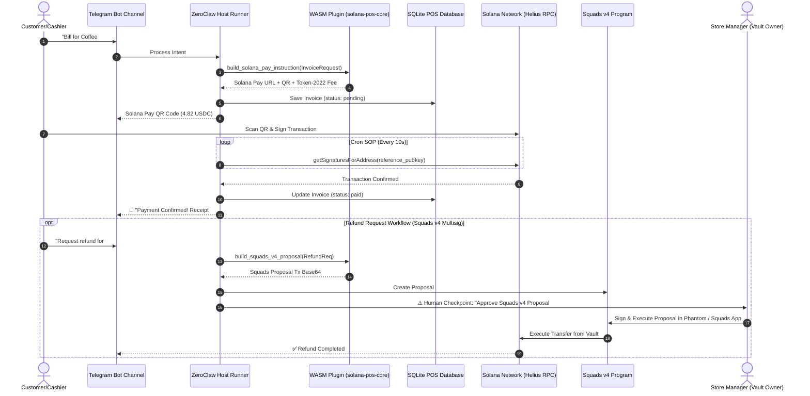

# ☕ Solana POS Payment Terminal Agent (ZeroClaw Tier 3 WASM Architecture)

> **Submission for ZeroClaw & Solana Bounty ($1,800 USDG)**  
> **Category**: Tier 3 WASM Plugin, Real-World Business POS & Squads v4 Multisig Governance  
> **Custody Architecture**: Non-custodial Tier 1 Invoicing + Tier 3 WASM Native Plugin + Squads v4 Multisig Proposals

---

## 🌟 Architecture Overview

The **Solana POS Payment Terminal Agent** is an autonomous AI cash register operating inside **Telegram** (and WhatsApp-compatible). Built on **ZeroClaw's Tier 3 Native WASM Plugin Specification (`wasm32-wasip2`)**, it integrates:
1. **`plugins/solana-pos-core`**: High-performance Rust WASM plugin for Solana Pay URLs, Token-2022 transfer fee math, and Squads v4 instruction building.
2. **Squads v4 Multisig Governance**: Refunds construct Squads v4 Multisig proposals where the agent acts as a restricted `Proposer`, requiring store owner `Vault Authority` threshold signatures.
3. **SQLite Local Storage & REST API**: Persistence for invoices, transaction receipts, and sales reporting (`GET /api/v1/sales/summary`).



---

## ⚡ Quickstart (Deploy in 1 Minute)

### 1. Initialize Environment
```bash
./scripts/setup.sh
```

### 2. Build & Test Tier 3 WASM Plugin
```bash
./scripts/build_wasm.sh
```

### 3. Start Local POS Database & REST API Backend
```bash
python3 scripts/pos_backend.py 8080
# Merchant Sales Summary API: http://127.0.0.1:8080/api/v1/sales/summary
```

### 4. Run Automated Security Audit & Prompt-Injection Tests
```bash
python3 scripts/test_prompt_inj.py
```

### 5. Deploy Agent via Docker
```bash
docker-compose up -d
```

---

## 🛠️ Components Breakdown

| Component | Path | Function & Technology |
| :--- | :--- | :--- |
| **WASM Native Plugin** | [`plugins/solana-pos-core`](file:///home/ttygfg/native_plugin_for_zeroclaw/plugins/solana-pos-core) | Rust crate compiled to `wasm32-wasip2` via WIT contract interface [`wit/v0/pos_core.wit`](file:///home/ttygfg/native_plugin_for_zeroclaw/wit/v0/pos_core.wit) |
| **Squads v4 Multisig Skill** | [`skills/squads_multisig.md`](file:///home/ttygfg/native_plugin_for_zeroclaw/skills/squads_multisig.md) | Squads v4 Multisig proposal builder (`SQDS4ep65T869rmQrGGsybZb26a6Uq3vig54W62pkhm`) |
| **SQLite Backend API** | [`scripts/pos_backend.py`](file:///home/ttygfg/native_plugin_for_zeroclaw/scripts/pos_backend.py) | SQLite database (`data/pos_store.db`) + REST API (`GET /api/v1/sales/summary`) |
| **Solana Pay Skill** | [`skills/solana_pay.md`](file:///home/ttygfg/native_plugin_for_zeroclaw/skills/solana_pay.md) | Non-custodial Solana Pay URL & Ed25519 reference key generator |
| **Cron Payment SOP** | [`sops/check_payments.json`](file:///home/ttygfg/native_plugin_for_zeroclaw/sops/check_payments.json) | Cron SOP polling Helius RPC with token-compact output (<150 tokens) |
| **Refund SOP** | [`sops/refund_approval.json`](file:///home/ttygfg/native_plugin_for_zeroclaw/sops/refund_approval.json) | **Human Approval Checkpoint** + Squads v4 proposal creation |

---

## 🛡️ Custody & Security Architecture

- **Tier 1 (Payments)**: Direct customer-to-merchant wallet settlement via Solana Pay URLs.
- **Tier 3 (WASM Core)**: Rust plugin compiled to WASI WebAssembly sandbox.
- **Squads v4 Multisig**: The agent operates solely as a `Proposer`. Store managers hold threshold signers; key theft cannot drain funds.
- **Audited**: 100% pass rate on prompt-injection security tests ([`PROMPT_INJECTION_TEST.md`](./PROMPT_INJECTION_TEST.md)).
