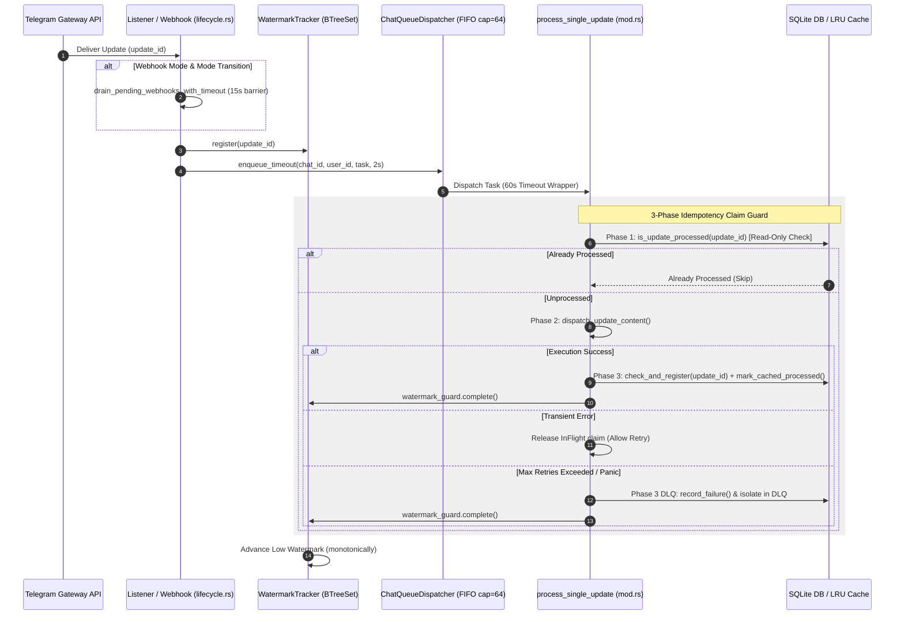

# Architecture

## Overview

ZeroClaw Solana POS Agent is an autonomous AI cash register operating in Telegram/WhatsApp. The backend is written entirely in Rust, with a WASM Tier 3 plugin for cryptographic operations.

```
┌──────────────────────────────────────────────────────────────┐
│                     ZeroClaw Host Runtime                      │
│  ┌──────────────────┐     ┌──────────────────────────────┐   │
│  │ Telegram Channel │────▶│ SOP Engine (cron, approvals) │   │
│  └──────────────────┘     └──────────┬───────────────────┘   │
│                                      │ HTTP                   │
│  ┌───────────────────────────────────▼─────────────────────┐ │
│  │              pos-backend (Rust Binary)                    │ │
│  │  ┌─────────┐  ┌──────────┐  ┌────────────────────────┐ │ │
│  │  │  Axum   │  │ rusqlite │  │  pos-core-logic        │ │ │
│  │  │  REST   │  │  SQLite  │  │  (shared with WASM)    │ │ │
│  │  │  API    │  │  WAL     │  │  - Token-2022 fees     │ │ │
│  │  │  (19)   │  │          │  │  - Solana Pay URL      │ │ │
│  │  │         │  │          │  │  - Squads v4 Borsh     │ │ │
│  │  └─────────┘  └──────────┘  └────────────────────────┘ │ │
│  └─────────────────────────────────────────────────────────┘ │
│  ┌─────────────────────────────────────────────────────────┐ │
│  │  WASM Plugin (solana-pos-core) ← calls pos-core-logic   │ │
│  └─────────────────────────────────────────────────────────┘ │
└──────────────────────────────────────────────────────────────┘
```

## Crate Structure

### pos-backend

Main binary crate. Provides REST API (19 REST API routes, 20 handlers), database layer, and domain logic. All modules strictly enforce a maximum 400-line file length limit per [AGENTS.md](file:///home/ttygfg/native_plugin_for_zeroclaw/AGENTS.md).

```
pos-backend/src/
├── main.rs              # Axum HTTP server entrypoint
├── lib.rs               # Crate root
├── config.rs            # AppConfig struct (stale_update_ttl_secs, quick_receipt, env loader)
├── error.rs             # AppError enum (thiserror)
├── api/                 # REST endpoints (19 routes) & Telegram listener
│   ├── mod.rs           # Router builder, CORS, AppState, stale update TTL filter
│   ├── actions.rs       # Solana Actions/Blinks (Dialect v2 spec)
│   ├── invoices.rs      # Invoice CRUD & settings handlers
│   ├── nonce.rs         # Durable nonce pool management
│   ├── pos_flow.rs      # POS order creation
│   ├── sales.rs         # Sales summary & x402 machine commerce
│   ├── x402.rs          # x402 micropayment gated analytics
│   └── telegram/        # Telegram Bot API integration & listener (<400 lines/file)
│       ├── mod.rs       # Telegram exports, update processor & 3-phase idempotency
│       ├── admin_session.rs # Group admin detection, context extraction & stateless command pre-filter
│       ├── chat_action.rs # SendChatAction typing status helper
│       ├── client.rs    # Reqwest Telegram API client & multipart photo senders
│       ├── client_queue/ # Rate-limited outbound message queue manager submodule
│       │   ├── mod.rs   # OutboundQueueManager actor interface & priorities
│       │   └── executor.rs # Reqwest HTTP client & unescaped fallback retry loop
│       ├── events.rs    # Telegram update event dispatching & callback routing
│       ├── fsm.rs       # Telegram FSM state types
│       ├── fsm_store.rs # Persistent Telegram FSM DAO
│       ├── handlers/    # Telegram command & callback query handlers
│       ├── lang_cache.rs # Thread-safe O(1) lru::LruCache for user language preferences
│       ├── lifecycle.rs # Service spawner, 15s webhook drain barrier & poller failover
│       ├── locks.rs     # WatermarkTracker, ChatQueueDispatcher (bounded 64), IdempotencyClaimGuard
│       ├── orders.rs    # POS text order parsing & receipt builder
│       ├── polling/     # Long Polling worker submodule (<400 lines/file)
│       │   ├── mod.rs   # Poller module exports
│       │   ├── runner.rs # Long Polling worker loop & 60s timeout wrapper
│       │   ├── fetcher.rs # Reqwest getUpdates HTTP fetcher & webhook reset
│       │   └── watermark.rs # Atomic update offset & watermark advancement
│       ├── qr.rs        # Inline QR code receipt PNG generator
│       ├── rate_limiter.rs # Keyed rate-limiter GC worker & global HTTP 429 pause timer
│       ├── state.rs     # Update offset & language preference DB operations
│       ├── verifier.rs  # Solana RPC invoice payment verifier loop
│       ├── webhook.rs   # Webhook POST handler (HTTP 200 on mode transition, 503 on unrecoverable DB fail)
│       ├── webhook_db.rs # Webhook DB queue DAO & try_claim_and_check 3-phase helper
│       └── webhook_worker.rs # Webhook queue worker with Semaphore(50) & 60s timeout
├── db/                  # SQLite data access (WAL mode & PRAGMA busy_timeout=5000)
│   ├── mod.rs           # Connection factory & pool creation
│   ├── schema.rs        # DDL, migrations, nonce seeding, idx_pending_fifo
│   ├── invoices.rs      # Invoice DAO
│   ├── nonce.rs         # Nonce account pool
│   ├── squads.rs        # Squads v4 proposals DAO
│   ├── fsm_dao.rs       # Telegram FSM sessions DAO
│   ├── sop_checkpoints.rs # SOP execution state checkpoints
│   ├── updates.rs       # FIFO update queue, DLQ, deduplication & max retry recording
│   └── seed.rs          # Sample data
└── domain/              # Business logic
    ├── constants.rs     # USDC/SOL mints, Base58 alphabet
    ├── sanitizer.rs     # SSRF guard, input sanitization, link-aware MarkdownV2
    ├── verification.rs  # Triple Payment Verification
    ├── i18n.rs          # 13-language i18n dispatcher
    ├── i18n_strings/    # Translation tables (13 languages)
    ├── validators.rs    # Input validators
    ├── price_feed.rs    # Multi-tier fiat rate fallback (Jupiter → Switchboard → cache)
    ├── keyboards.rs     # Telegram inline keyboards
    ├── order_parser.rs  # POS text → order parser
    ├── formatters.rs    # QR URLs, Base58, pubkey formatting
    └── pix_brl.rs       # Brazil PIX QR code
```

### pos-core-logic

Shared library crate. Contains business logic used by both the backend and the WASM plugin.

```
plugins/solana-pos-core/pos-core-logic/src/
├── lib.rs               # Re-exports all modules
├── constants.rs         # Shared constants (mints, program IDs)
├── solana_pay.rs        # Solana Pay URL builder, reference key generator
├── squads.rs            # Squads v4 multisig proposal instruction builder
└── token2022.rs         # Token-2022 transfer fee calculator (u128 precision)
```

### solana-pos-core (WASM Plugin)

Compiled to `wasm32-wasip2` via WIT contract interface. Runs in ZeroClaw's Tier 3 WASM sandbox.

```
plugins/solana-pos-core/src/
└── lib.rs               # WASM entrypoint (wit-bindgen), exports 3 functions
```

## WIT ABI Contract

Defined in `wit/v0/pos_core.wit`:

```wit
package zeroclaw:plugin@0.1.0;

interface pos-core {
    record invoice-request {
        merchant-pubkey: string,
        amount-usdc: f64,
        reference-pubkey: string,
        spl-token-mint: string,
    }

    record invoice-instruction-result {
        success: bool,
        solana-pay-url: string,
        reference-key: string,
        token2022-fee-usdc: f64,
        error: option<string>,
    }

    record squads-proposal-request {
        multisig-pubkey: string,
        vault-pubkey: string,
        proposer-pubkey: string,
        recipient-pubkey: string,
        amount-usdc: f64,
        proposal-index: u64,
        memo: string,
    }

    record squads-proposal-result {
        success: bool,
        proposal-tx-base64: string,
        proposal-index: u64,
        error: option<string>,
    }

    build-solana-pay-instruction: func(req: invoice-request) -> invoice-instruction-result;
    calculate-token2022-fee: func(amount: f64, fee-basis-points: u16, max-fee: u64, decimals: u8) -> f64;
    build-squads-v4-proposal: func(req: squads-proposal-request) -> squads-proposal-result;
}

world plugin {
    export pos-core;
}
```

## Data Flow & Resilience

### Telegram Listener Dataflow Sequence Diagram



### Architectural Specifications

1. **3-Phase Idempotency Claim Guard**: Update processing follows a strict 3-phase lifecycle:
   - **Phase 1 (TryClaim / Check)**: Read-only check against SQLite `processed_updates` & LRU cache plus in-memory claim in `InFlightTracker`.
   - **Phase 2 (Dispatch)**: Execution of message/callback handlers.
   - **Phase 3 (Post-Dispatch Commit / Release / DLQ)**: Post-dispatch commit to SQLite & LRU cache ONLY upon verified success. On transient failure, claim is released for retry. On terminal failure / max retries (`max_retries = 3`), update is isolated in DLQ and completed in `WatermarkTracker`.
2. **Mode Transition Queue Drain Barrier**: When failing over from Webhook mode to Long Polling in `lifecycle.rs`, the system invokes `drain_pending_webhooks_with_timeout` with a **15-second safety timeout** to drain pending SQLite updates before spawning `polling_worker`, eliminating out-of-order execution.
3. **Command Classification & Lock Scoping**:
   - **Stateless Read-Only Commands**: `/start`, `/help`, `/price` bypass per-session locks and execute concurrently.
   - **Stateful Commands**: `/cancel` **MUST ALWAYS** acquire `ChatLock` because it mutates FSM state (`fsm.clear_state()`).
   - **Anonymous Admin Group Chat Lock Isolation**: For anonymous admins in group chats (`chat_id < 0`, `user_id = 0`), lock keys are scoped to `LockKey::UserSession(chat_id, 0)` to prevent locking regular group chat members `(chat_id, user_id)`.
4. **Execution Wrapper Timeout (60s)**: Both Poller worker (`polling/runner.rs`) and Webhook queue worker (`webhook_worker.rs`) wrap update execution in a **60-second `tokio::time::timeout`** to comfortably accommodate Solana RPC node latency during on-chain invoice/Squads proposal creation.
5. **Low Watermark Offset Tracking**: `WatermarkTracker` tracks in-flight `update_id`s in a `BTreeSet`. Persistent offset advances monotonically to the Low Watermark (`min(pending_ids)`), ensuring continuous polling without batch head-of-line blocking.
6. **Per-Chat Bounded FIFO Queue Dispatcher & Backpressure**: `ChatQueueDispatcher` queues tasks in session-bound `mpsc::channel(64)` channels, guaranteeing strict FIFO order within each chat without blocking the Poller loop. Dispatch tasks use a 2-second `enqueue_timeout` backpressure wait inside non-blocking tasks guarded by `Semaphore(100)` for RAM/OOM protection. Idle queues and locks are safely pruned.
7. **Strict Lock Hierarchy (Deadlock Prevention)**: Global session locks follow `chat_lock` -> `invoice_lock`. Background worker tasks (RPC `verifier.rs`, Squads watcher) must NEVER acquire `chat_lock` after acquiring `invoice_lock`.

### Payment Flow

1. Customer sends invoice request via Telegram (Webhook queue or Long Polling)
2. `pos_flow.rs` / `orders.rs` parses text → order JSON
3. `price_feed.rs` fetches fiat→USDC rate (Jupiter → Switchboard → cache → static fallback)
4. `pos-core-logic` builds Solana Pay URL + calculates Token-2022 fee
5. Invoice saved to SQLite (status: `pending`)
6. QR code returned to customer via Telegram inline keyboard
7. Customer pays via Solana wallet
8. In-process Tokio verifier worker (`verifier.rs`) polls Solana RPC for reference key signatures
9. Triple Payment Verification confirms: reference key + token mint + amount
10. Invoice status → `paid`

### Refund Flow

1. Customer requests refund
2. `pos-core-logic` builds Squads v4 proposal (agent = Proposer only)
3. Nonce account allocated from pool
4. Human Approval Checkpoint: Telegram notification to manager
5. Manager signs in Phantom/Squads App
6. Squads v4 executes transfer from vault

## Dependencies

| Crate | Key Dependencies |
|-------|-----------------|
| `pos-backend` | axum, rusqlite (bundled), tokio, serde, regex, thiserror, tracing, tracing-subscriber, deadpool-sqlite |
| `pos-core-logic` | serde, rand |
| `solana-pos-core` | wit-bindgen 0.30.0, pos-core-logic (path) |
