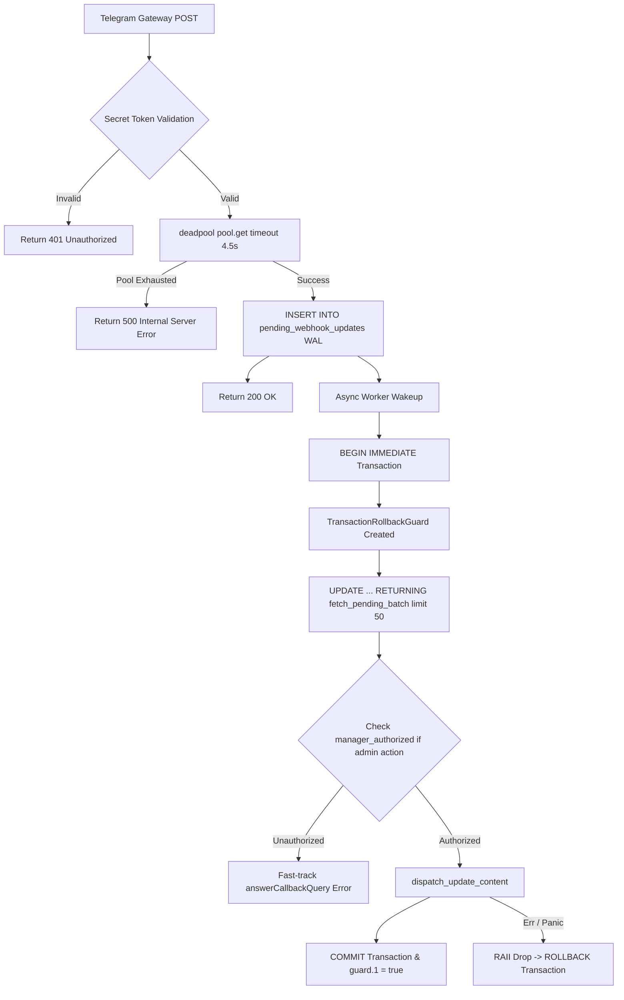

# Architecture

## Overview

ZeroClaw Solana POS Agent is an autonomous AI cash register operating in Telegram/WhatsApp. The backend is written entirely in Rust, with a WASM Tier 3 plugin for cryptographic operations.

```
┌──────────────────────────────────────────────────────────────┐
│                     ZeroClaw Host Runtime                      │
│  ┌──────────────────┐     ┌──────────────────────────────┐   │
│  │ Telegram Channel │────▶│ SOP Engine (cron, approvals) │   │
│  └──────────────────┘     └──────────┬───────────────────┘   │
│                                      │ HTTP                   │
│  ┌───────────────────────────────────▼─────────────────────┐ │
│  │              pos-backend (Rust Binary)                    │ │
│  │  ┌─────────┐  ┌──────────┐  ┌────────────────────────┐ │ │
│  │  │  Axum   │  │ rusqlite │  │  pos-core-logic        │ │ │
│  │  │  REST   │  │  SQLite  │  │  (shared with WASM)    │ │ │
│  │  │  API    │  │  WAL     │  │  - Token-2022 fees     │ │ │
│  │  │         │  │          │  │  - Solana Pay URL      │ │ │
│  │  │         │  │          │  │  - Squads v4 Borsh     │ │ │
│  │  └─────────┘  └──────────┘  └────────────────────────┘ │ │
│  └─────────────────────────────────────────────────────────┘ │
│  ┌─────────────────────────────────────────────────────────┐ │
│  │  WASM Plugin (solana-pos-core) ← calls pos-core-logic   │ │
│  └─────────────────────────────────────────────────────────┘ │
└──────────────────────────────────────────────────────────────┘
```

## Crate Structure

### pos-backend

Main binary crate. Provides REST API, database layer, and domain logic.

```
pos-backend/src/
├── main.rs              # Axum HTTP server entrypoint
├── lib.rs               # Crate root
├── config.rs            # AppConfig struct, env-var loader
├── error.rs             # AppError enum (thiserror)
├── api/                 # REST endpoints & Telegram listener
│   ├── mod.rs           # Router builder, CORS, AppState
│   ├── actions.rs       # Solana Actions/Blinks
│   ├── invoices.rs      # Invoice CRUD
│   ├── nonce.rs         # Durable nonce pool
│   ├── pos_flow.rs      # POS order creation
│   ├── sales.rs         # Sales summary
│   ├── x402.rs          # x402 machine commerce
│   └── telegram/        # Telegram Bot API integration & listener
│       ├── mod.rs       # Telegram module exports, update processor & extract_invoice_id
│       ├── admin_session.rs # Anonymous group admin detection & Stateless Mode routing
│       ├── chat_action.rs # SendChatAction typing status helper
│       ├── client.rs    # Reqwest Telegram API client & helpers
│       ├── client_queue.rs # Rate-limited outbound message queue actor & 429 escalation
│       ├── events.rs    # Telegram update event dispatching & callback routing
│       ├── fsm.rs       # Telegram FSM state types
│       ├── fsm_store.rs # Persistent Telegram FSM DAO
│       ├── handlers/    # Telegram command & callback query handlers
│       ├── lang_cache.rs # Thread-safe O(1) lru::LruCache for user language preferences
│       ├── lifecycle.rs # Service spawner & graceful child_token shutdown handles
│       ├── locks.rs     # ChatLocksManager (LockKey::UserSession & LockKey::Invoice)
│       ├── orders.rs    # POS text order parsing & receipt builder
│       ├── polling.rs   # Long Polling loop worker with monotonic AtomicI64 offset
│       ├── qr.rs        # Inline QR code receipt builder
│       ├── rate_limiter.rs # Keyed rate-limiter GC worker & global HTTP 429 pause timer
│       ├── state.rs     # Language preference DB operations
│       ├── verifier.rs  # Solana RPC invoice payment verifier loop
│       ├── webhook.rs   # Webhook POST handler returning 500 on DB timeout for zero data loss
│       ├── webhook_db.rs # Webhook DB helper functions
│       └── webhook_worker.rs # Webhook FIFO queue worker with Semaphore(50) backpressure
├── db/                  # SQLite data access
│   ├── mod.rs           # Connection factory (WAL mode & pragmas)
│   ├── schema.rs        # DDL, migrations, nonce seeding, idx_pending_fifo
│   ├── invoices.rs      # Invoice DAO
│   ├── nonce.rs         # Nonce account pool
│   ├── squads.rs        # Squads v4 proposals
│   ├── fsm_dao.rs       # Telegram FSM sessions DAO
│   ├── sop_checkpoints.rs
│   ├── updates.rs       # TransactionRollbackGuard, FIFO update queue, DLQ, deduplication
│   └── seed.rs          # Sample data
└── domain/              # Business logic
    ├── constants.rs     # USDC/SOL mints, Base58 alphabet
    ├── sanitizer.rs     # SSRF guard, input sanitization, link-aware MarkdownV2
    ├── verification.rs  # Triple Payment Verification
    ├── i18n.rs          # 13-language i18n dispatcher
    ├── i18n_strings/    # Translation tables (13 languages)
    ├── validators.rs    # Input validators
    ├── price_feed.rs    # Multi-tier fiat rate fallback
    ├── keyboards.rs     # Telegram inline keyboards
    ├── order_parser.rs  # POS text → order parser
    ├── formatters.rs    # QR URLs, Base58, pubkey formatting
    └── pix_brl.rs       # Brazil PIX QR code
```

### pos-core-logic

Shared library crate. Contains business logic used by both the backend and the WASM plugin.

```
plugins/solana-pos-core/pos-core-logic/src/
├── lib.rs               # Re-exports all modules
├── constants.rs         # Shared constants (mints, program IDs)
├── solana_pay.rs        # Solana Pay URL builder, reference key generator
├── squads.rs            # Squads v4 multisig proposal instruction builder
└── token2022.rs         # Token-2022 transfer fee calculator (u128 precision)
```

### solana-pos-core (WASM Plugin)

Compiled to `wasm32-wasip2` via WIT contract interface. Runs in ZeroClaw's Tier 3 WASM sandbox.

```
plugins/solana-pos-core/src/
└── lib.rs               # WASM entrypoint (wit-bindgen), exports 3 functions
```

## WIT ABI Contract

Defined in `wit/v0/pos_core.wit`:

```wit
package zeroclaw:plugin@0.1.0;

interface pos-core {
    record invoice-request {
        merchant-pubkey: string,
        amount-usdc: f64,
        reference-pubkey: string,
        spl-token-mint: string,
    }

    record invoice-instruction-result {
        success: bool,
        solana-pay-url: string,
        reference-key: string,
        token2022-fee-usdc: f64,
        error: option<string>,
    }

    record squads-proposal-request {
        multisig-pubkey: string,
        vault-pubkey: string,
        proposer-pubkey: string,
        recipient-pubkey: string,
        amount-usdc: f64,
        proposal-index: u64,
        memo: string,
    }

    record squads-proposal-result {
        success: bool,
        proposal-tx-base64: string,
        proposal-index: u64,
        error: option<string>,
    }

    build-solana-pay-instruction: func(req: invoice-request) -> invoice-instruction-result;
    calculate-token2022-fee: func(amount: f64, fee-basis-points: u16, max-fee: u64, decimals: u8) -> f64;
    build-squads-v4-proposal: func(req: squads-proposal-request) -> squads-proposal-result;
}

world plugin {
    export pos-core;
}
```

## Data Flow

### Telegram Update Processing Flow



### Payment Flow

1. Customer sends invoice request via Telegram (Webhook queue or Long Polling)
2. `pos_flow.rs` / `orders.rs` parses text → order JSON
3. `price_feed.rs` fetches fiat→USDC rate (Jupiter → Switchboard → cache → static fallback)
4. `pos-core-logic` builds Solana Pay URL + calculates Token-2022 fee
5. Invoice saved to SQLite (status: `pending`)
6. QR code returned to customer via Telegram inline keyboard
7. Customer pays via Solana wallet
8. In-process Tokio verifier worker (`verifier.rs`) polls Solana RPC for reference key signatures
9. Triple Payment Verification confirms: reference key + token mint + amount
10. Invoice status → `paid`

### Refund Flow

1. Customer requests refund
2. `pos-core-logic` builds Squads v4 proposal (agent = Proposer only)
3. Nonce account allocated from pool
4. Human Approval Checkpoint: Telegram notification to manager
5. Manager signs in Phantom/Squads App
6. Squads v4 executes transfer from vault

## WASM Tier 3 Justification

- **Token-2022 Deterministic Fee Math**: u128 checked multiplication eliminates IEEE 754 float precision drift
- **Cryptographic Payload Isolation**: Squads v4 Anchor instruction serialization in memory-isolated sandbox
- **Zero Private Key Scope**: WASM plugin has no access to store keys

## Dependencies

| Crate | Key Dependencies |
|-------|-----------------|
| `pos-backend` | axum, rusqlite (bundled), tokio, serde, regex, thiserror |
| `pos-core-logic` | serde, rand |
| `solana-pos-core` | wit-bindgen 0.30.0, pos-core-logic (path) |
