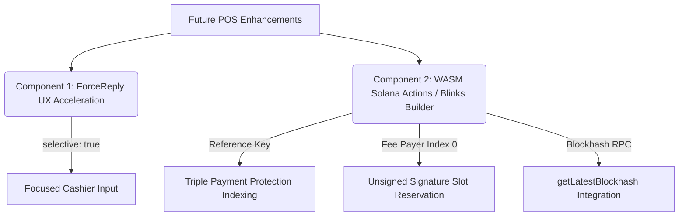
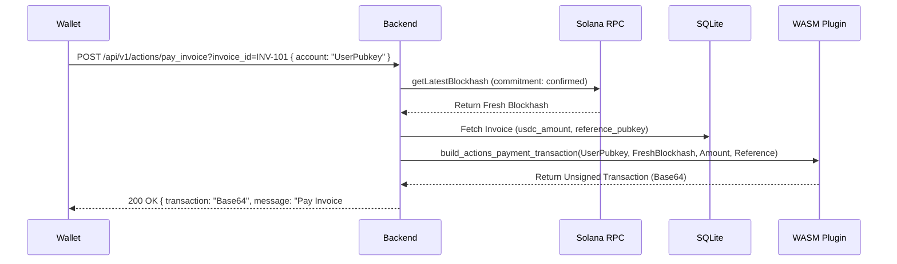

# Future POS Terminal Enhancements & Completed Roadmap

This document tracks completed enhancements and future architecture specifications for the **ZeroClaw Solana POS Agent** project.

---

## ✅ Completed Enhancements (v1.0.0 Production Release)

- **[COMPLETED] WASM-Driven Solana Actions / Blinks Transaction Builder (`solana_pay.rs` & `actions.rs`)**: Implemented `build_actions_payment_transaction()` in `pos-core-logic` and REST endpoints (`GET /actions.json`, `GET /api/v1/actions/pay_invoice`, `POST /api/v1/actions/pay_invoice`) returning unsigned Base64 Solana transactions with reference key metadata indexing and fee-payer signature slot reservation.
- **[COMPLETED] Zero-Data-Loss Webhook Ingestion (`webhook.rs`)**: Synchronous WAL insertion with a 4.5s connection pool acquire timeout returning HTTP 500 status codes for gateway retries.
- **[COMPLETED] Keyed Rate Limiter GC & Monotonic Pause Timer (`rate_limiter.rs`)**: Periodic 10-minute `retain_recent_keys()` memory cleanup pass and monotonic `tokio::time::Instant` HTTP 429 global pause timer with auto-reset guard.
- **[COMPLETED] Stateless Supergroup Admin Mode (`admin_session.rs`)**: Anonymous admin posts (`from` missing) and linked channel forwards execute in Stateless One-Shot Mode (`user_id = 0`) to prevent FSM cross-contamination while preserving `from.id` authorization for callback queries.
- **[COMPLETED] Bounded Poller Execution & DLQ Backoff (`polling.rs`)**: Wrapped update tasks in 30-second timeouts with 3 exponential backoff retries on transient DB errors.
- **[COMPLETED] Fast-Track Callback Query Acknowledgment (`callbacks.rs`)**: Immediate `answerCallbackQuery` execution prior to SQLite locks, eliminating `query is too old` client timeouts.

---

## 📋 Architecture & Feature Specifications



---

### Component 1: Cashier Haptic UX Acceleration (Telegram ForceReply)

#### Motivation & User Experience
When a cashier types an item name without specifying a price (e.g. `Cappuccino`), the backend returns `action: "prompt_price"`. Adding `"reply_markup": { "force_reply": true, "selective": true }` to the JSON response instructs the Telegram client to automatically focus the cashier's text input box with a quote reply.

- `"force_reply": true`: Automatically opens and focuses the text entry keyboard on mobile/desktop terminals.
- `"selective": true`: Restricts text focus strictly to the cashier who initiated the command, avoiding interference with other users if the bot is deployed in a group channel.

#### Implementation Target
- File: [`pos-backend/src/api/pos_flow.rs`](file:///home/ttygfg/native_plugin_for_zeroclaw/pos-backend/src/api/pos_flow.rs)
- Handler: `handle_create_order`
- Response Payload:
  ```json
  {
    "action": "prompt_price",
    "message": "Будь ласка, вкажіть суму для 'Cappuccino'",
    "items": "Cappuccino",
    "parse_mode": "MarkdownV2",
    "reply_markup": {
      "force_reply": true,
      "selective": true
    }
  }
  ```

---

### Component 2: WASM-Driven Solana Actions / Blinks Transaction Builder



#### Motivation & Architecture
Implementing Solana Actions (Blinks) specification v2.1.3 allows customers to scan a QR code or click a Blink link directly from Phantom, Solflare, or Dialect to pay an invoice.

To keep `pos-backend` ultra-lightweight without adding heavy Solana client SDK crates (`solana-sdk`, `solana-client`), transaction building is delegated directly to the **`solana-pos-core` WASM plugin**.

#### Specification & Binary Layout
1. **RPC Recent Blockhash**: `handle_action_post` executes a fast `getLatestBlockhash` JSON-RPC call (`commitment: "confirmed"`) to fetch a fresh blockhash (< 1 min old) before calling WASM assembly.
2. **Unsigned Fee-Payer Account Order**:
   - `accountKeys[0]`: `user_wallet_pubkey` (set as `fee_payer` with `num_required_signatures = 1`).
   - `accountKeys[1]`: `merchant_ata_pubkey` (destination token account).
   - `accountKeys[2]`: `usdc_mint_pubkey` (Token-2022 / SPL Token mint).
   - `accountKeys[3]`: `reference_pubkey` (non-signer, non-writable index key).
   - `accountKeys[4]`: `spl_token_program_id`.
3. **Signature Reservation Slot**:
   - The WASM serializer prepends a single-element signature array header `[1]` followed by 64 zero bytes `[0; 64]`.
   - The user's wallet decodes this Base64 payload, replaces the zero bytes with a valid Ed25519 signature, and submits the transaction.
4. **Reference Key Metadata Indexing**:
   - `reference_pubkey` is included as a non-signer, non-writable account (`is_signer: false, is_writable: false`) in the instruction accounts list.
   - Solana records this pubkey in transaction metadata, allowing our automated cron (`check_payments.json` / `/verify-transaction`) to instantly index and verify the payment.

#### Implementation Target
- File: [`plugins/solana-pos-core/pos-core-logic/src/solana_pay.rs`](file:///home/ttygfg/native_plugin_for_zeroclaw/plugins/solana-pos-core/pos-core-logic/src/solana_pay.rs)
- Function:
  ```rust
  pub fn build_actions_payment_transaction(
      user_wallet_pubkey: &str,
      merchant_ata_pubkey: &str,
      amount_usdc: f64,
      usdc_mint_pubkey: &str,
      reference_pubkey: &str,
      recent_blockhash: &str,
  ) -> Result<String, &'static str>
  ```
- File: [`pos-backend/src/api/actions.rs`](file:///home/ttygfg/native_plugin_for_zeroclaw/pos-backend/src/api/actions.rs)
- Handler: `handle_action_post`

---

## 🧪 Verification Plan

1. **ForceReply Unit Test** (`pos-backend/tests/suites/test_pos_flow.rs`):
   - `test_368_prompt_price_includes_force_reply`: Verify prompt_price response contains `"reply_markup": { "force_reply": true, "selective": true }`.
2. **WASM Solana Actions Serialization Test** (`plugins/solana-pos-core/pos-core-logic/`):
   - `test_build_actions_payment_transaction_valid`: Assert base64 output decodes into a compliant wire transaction with `user_wallet` at index 0, 64 zero bytes signature slot, and `reference_key` present in account keys.
3. **Blinks Action POST Endpoint Test** (`pos-backend/tests/suites/test_api_endpoints.rs`):
   - `test_369_actions_post_payment_transaction`: Send `POST /api/v1/actions/pay_invoice?invoice_id=INV-T1` and verify `200 OK` response with `X-Action-Version: 2.1.3` header and base64 `"transaction"` payload.
4. **Full Automated Suite**:
   - Execute `./scripts/verify_all.sh` to ensure zero errors, zero warnings, and 100% test pass rate.
